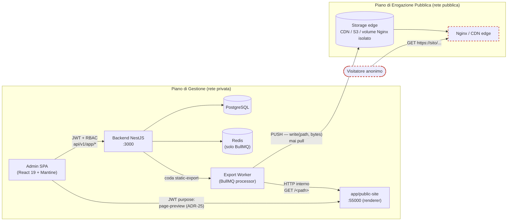
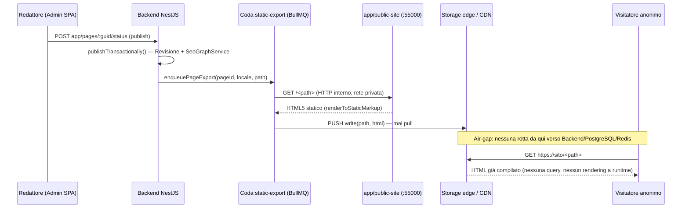

# System Architecture — CMS

> Descrizione di come il sistema è fatto **oggi**, più i punti di aggancio previsti per
> il dominio CMS. Priorità: dopo Glossary.
>
> Ultima revisione: 2026-09-04 — aggiunta la topologia di rete Air-Gapped SSG (ADR-53):
> separazione fra Piano di Gestione e Piano di Erogazione Pubblica, regola di air-gap,
> porta `app/public-site` (55000). Aggiornamento su richiesta umana esplicita, task di
> allineamento documentale ad ADR-53; non tocca le sezioni non relative alla topologia
> pubblica (restano riferite alla revisione del 2026-08-13).

---

## Struttura monorepo

```
cms/
├── app/
│   ├── backend/       ← NestJS 11, porta 3000
│   ├── frontend/      ← React 19 + Vite, porta 5173
│   └── public-site/   ← Motore di rendering/anteprima, porta 55000 (ADR-53, § Topologia)
├── bruno/          ← Collezioni API testing (OpenCollection YAML)
├── e2e/            ← Test browser Playwright
└── docs/
```

Package manager: **npm workspaces** (`["app/*"]`) — tutti i comandi si lanciano dalla root.

---

## Le due superfici API

Il CMS espone due superfici con requisiti opposti (Constitution, Principle 8). Non vanno
mai servite dallo stesso controller.

| | Superficie amministrativa | Superficie pubblica |
|---|---|---|
| Prefisso | `api/v1/app/<modulo>` | `api/v1/public/<risorsa>` |
| Autenticazione | JWT obbligatorio | Anonima |
| Autorizzazione | RBAC a soglie di ruolo | Nessuna |
| Operazioni | Lettura e scrittura | **Sola lettura** |
| Contenuto visibile | Tutti gli stati | Solo `published` |
| Cache | Mai | — (vedi nota) |
| Rate limiting | Standard | Proprio, più stringente |
| Stato | ✅ Attiva | ✅ Attiva (F03), architettura Air-Gapped SSG — vedi § Topologia sotto |

> **Nota post-ADR-53**: `api/v1/public/*` resta il contratto di lettura usato **solo**
> internamente, dal job di export statico e dalla rotta di anteprima (ADR-25) — non è più
> il percorso del traffico anonimo di produzione, che è servito da file HTML pre-compilati
> su storage edge (§ Topologia). La riga "Cache: Redis, invalidazione per evento" di ADR-23
> descriveva quel traffico anonimo: con ADR-53 quel traffico non passa più da qui, e Redis
> non ha più chiavi `public:*` (resta solo backend BullMQ).

Gli endpoint di autenticazione restano sotto `api/v1/auth/`.
Swagger UI (solo fuori produzione): `api/v1/docs`.

---

## Topologia di rete — Piano di Gestione vs Piano di Erogazione Pubblica (ADR-53)

Con **ADR-53** (supera ADR-22/ADR-23/ADR-24, completa ADR-45) il sistema è composto da due
piani infrastrutturali distinti, con un solo canale ammesso fra loro: **push**, mai **pull**.

- **Piano di Gestione** — Backend NestJS (porta 3000), PostgreSQL, Redis (solo backend
  BullMQ da F03 in poi), il motore di rendering `app/public-site` (porta 55000, uso interno +
  anteprima autenticata). Qui vive ogni scrittura, ogni stato, ogni segreto.
- **Piano di Erogazione Pubblica** — storage edge (CDN, bucket S3-compatibile o volume Nginx
  isolato) che serve file `.html`/asset statici al traffico anonimo. Nessun processo
  applicativo, nessun database, nessuna sessione.

L'unico punto di attraversamento fra i due piani è il **worker della coda `static-export`**
(`app/backend/src/export/`, ADR-45): legge dal Piano di Gestione, scrive/spinge verso il
Piano di Erogazione Pubblica. Nessun altro componente attraversa il confine.



**Regola Air-Gap (vincolante, ADR-53 § 4/Conformità)**: nessun canale di rete in ingresso
(PULL) è consentito dalla superficie pubblica (visitatore, Nginx/CDN edge) verso il Piano di
Gestione (PostgreSQL, Redis, backend NestJS). Il visitatore anonimo non raggiunge mai
`api/v1/*`; l'unico traffico che attraversa il confine è quello generato **dal Piano di
Gestione verso lo storage edge** (push del worker di export). La regola è **di
infrastruttura/rete** (firewall, security group, assenza di rotta), verificabile a livello di
configurazione di deploy — non una convenzione applicativa che un controller potrebbe violare
domani.



**Conseguenze dirette sulla tabella delle superfici API** sopra: la superficie pubblica
storica (`api/v1/public/*`) non sparisce — resta il contratto che il worker di export e la
rotta di anteprima usano internamente — ma cessa di essere ciò che il traffico anonimo
raggiunge. Il vero "endpoint pubblico" in produzione, dal punto di vista del visitatore, è
oggi lo storage edge, fuori dal perimetro `api/v1`.

---

## Comunicazione Frontend ↔ Backend

- Protocollo: **REST over HTTP**
- Base URL dev: `http://localhost:3000/api/v1`
- Base URL prod: da variabile d'ambiente `VITE_API_BASE_URL`

---

## Autenticazione

- **Access token**: JWT firmato via `jsonwebtoken` (`jwt.sign`/`jwt.verify` diretti — non
  `@nestjs/jwt`/Passport, pattern volutamente leggero), durata default 15 minuti
  (`JWT_EXPIRATION`), inviato nell'header `Authorization: Bearer <token>`.
  Payload: `{ id, name, email, role, scopeId, jti, impersonatedBy? }`, `jti` generato con
  `Utils.randomString(16)`.
- **Refresh token (`rtk`)**: token **opaco** (non JWT), durata default 7 giorni
  (`RTK_EXPIRATION` in secondi), salvato in **cookie httpOnly signed** (`rtk`, path `/`),
  con **rotation** ad ogni utilizzo (la vecchia chiave `rtk:` e la vecchia `login:`
  associata vengono cancellate da Redis).
  Il cookie imposta esplicitamente `secure` (solo in produzione, via
  `AppConstants.isProduction`) e `sameSite: 'lax'` — nessun token CSRF dedicato, ritenuto
  ridondante data la combinazione con CORS a origine singola ed endpoint sensibili solo
  `POST` (vedi `docs/ai/adr/ADR-14-cookie-samesite-csrf.md`).
- **Allowlist di sessione**: ogni access token valido ha una chiave Redis
  `login:${accessToken}` con TTL derivato da `JWT_EXPIRATION` (utility
  `parseDurationToSeconds`). `AuthMiddleware` la richiede sempre, oltre alla verifica
  della firma JWT: un token con firma valida ma assente dall'allowlist (es. dopo logout)
  viene rifiutato.
- **Frontend**: l'access token è salvato in `localStorage` con chiave `access_token`
  (utente decodificato in cache: `auth_user`; preferenza tema: `color_scheme`).
- **Flusso refresh**: Axios interceptor intercetta il 401, chiama `POST auth/refresh` con
  il cookie `rtk`, aggiorna access token (+ nuovo cookie `rtk`) e ritenta la richiesta
  originale; se il refresh fallisce, redirect a `/login`.
- **AuthMiddleware**: globale su tutte le rotte eccetto `api/v1/auth/*` pubblici,
  `api/v1/health`, `/metrics` e — quando esisteranno — `api/v1/public/*`.
- **MFA**: sfida post-login con chiave Redis `mfa_tmp:${tmpToken}` → `{ userId }`, TTL 300s.
- **Sessioni/dispositivi (`GET/DELETE auth/sessions`)**: oltre alle chiavi effimere
  `login:`/`rtk:` (che ruotano ad ogni refresh), ogni login genera un `sessionId` opaco
  stabile (`Utils.randomString(16)`) che identifica il "dispositivo" per tutta la durata
  del refresh token: chiave Redis `session:${sessionId}` → `{ userId, ip, userAgent,
  createdAt, lastUsedAt, refreshToken, accessToken }`, TTL allineato a `RTK_EXPIRATION` e
  rinnovato ad ogni refresh. Indice per utente: set Redis `user-sessions:${userId}`.
  Revocare una sessione cancella sia `rtk:${refreshToken}` sia `login:${accessToken}`
  correnti. Il `logout` esegue la stessa pulizia per la sessione corrente. Non tracciato
  durante l'impersonificazione (nessun refresh token generato in quel flusso). Vedi
  `docs/ai/adr/ADR-13-gestione-sessioni-dispositivi.md` (bozza, in attesa di approvazione).

---

## Realtime — Socket.io

- Server: NestJS Gateway sullo stesso processo HTTP (porta 3000), namespace `/realtime`
- Client: `socket.io-client` nel frontend, dietro `VITE_SOCKET_URL` — se assente la UI
  resta funzionante ma senza push istantaneo (nessun polling di fallback)
- Autenticazione socket: token JWT nell'handshake + verifica allowlist di sessione Redis
  (stessa allowlist di `AuthMiddleware`); il client si unisce alla room `user:${userId}`
  per ricevere solo gli eventi a lui destinati (`AppGateway.emitToUser`)
- Uso attuale: push della campanella notifiche (ADR-12)
- Uso previsto dal dominio CMS: segnalazione della presenza di più editor sulla stessa
  Pagina (F01/F04). **Non** editing collaborativo carattere-per-carattere.

---

## Database

- **DBMS**: PostgreSQL (dev: `cms_db` / utente `cms` / password `cms`, via
  `docker-compose.yml` in root, esposto sulla porta host **5432**)
- **ORM**: Drizzle ORM — schema centralizzato in `app/backend/src/db/schema.ts`
- **Migrazioni**: generate con `drizzle-kit generate`, applicate con `drizzle-kit migrate`
- **Mai** eseguire `drizzle-kit push` in produzione

Ogni tabella include obbligatoriamente:
```
id          serial PRIMARY KEY
guid        char(16) — usato nelle URL amministrative, mai l'id numerico
isActive    boolean DEFAULT true — soft delete
createdAt   timestamp
updatedAt   timestamp
createdBy   integer FK → users.id
updatedBy   integer FK → users.id
```

**Entità presenti oggi**: `users`, `audit_log`, `app_settings`, `files`, `notifications`.
Non esiste una tabella `logins`: Redis è l'unica session store.

**Entità previste dal dominio CMS** (nessuna ancora implementata; ogni tabella richiede
approvazione umana esplicita prima di toccare `schema.ts`): `pages`, `page_revisions`,
`redirects`, `menus`, `forms`, `form_submissions`. La proposta di schema per le prime due
è in `docs/ai/specs/SPEC-F01-gestione-pagine.md`.

Il contenuto strutturato (albero blocchi, metadati SEO/GEO) va in colonne **`jsonb`**, mai
in `text` con JSON serializzato a mano.

---

## Cache e sessioni — Redis

- Client: **ioredis**
- Usato per: allowlist di sessione (`login:${accessToken}`), refresh token opachi
  (`rtk:${refreshToken}`), sfida MFA (`mfa_tmp:${tmpToken}`), sessioni/dispositivi
  (`session:${sessionId}`), code BullMQ
- Uso previsto dal dominio CMS: cache delle risposte pubbliche di contenuto, con
  **invalidazione per evento** (pubblicazione, archiviazione, cambio slug, modifica di una
  Sezione globale o di un Menu). Mai scadenza per solo TTL.
- URL: variabile d'ambiente `REDIS_URL` (dev: porta host **6379**)

---

## Job asincroni — BullMQ

- Basato su Redis
- Usato per: invio email (obbligatorio, mai invio diretto da un service), pulizia blob dei
  file soft-deleted
- Moduli **separati**:
  - `src/mailer/` — costruzione/rendering email, wrapping Nodemailer
  - `src/queues/email-queue/` — coda BullMQ dedicata, processor che chiama il mailer
- Code previste dal dominio CMS: pubblicazione programmata delle Pagine, generazione delle
  varianti dimensionali dei media, notifica degli Invii dei moduli di contatto. Ognuna
  sotto `src/queues/<nome-coda>/`, stesso pattern.

---

## Job schedulati — cron dichiarativo e repeatable job (ADR-11)

Due meccanismi distinti, scelti in base a se il job può essere eseguito più volte in
parallelo su repliche diverse dell'app (containerizzazione, ADR-6):

- **`@nestjs/schedule`** (`src/scheduler/`) — cron dichiarativo (`@Cron`), in-process,
  **nessuna deduplica tra repliche**: adatto solo a job idempotenti/senza side-effect
  distruttivi (es. `queue-health.task.ts`, logga i contatori delle code BullMQ ogni ora).
- **BullMQ repeatable job** — ricorrenza persistita su Redis: un solo worker esegue ogni
  occorrenza anche con più repliche attive, e la schedulazione sopravvive a
  restart/redeploy. Usato per `src/queues/files-cleanup-queue/`, che rimuove fisicamente
  il blob dei file soft-deleted oltre il periodo di grazia
  (`FILES_CLEANUP_GRACE_DAYS`) — **disabilitato di default**
  (`FILES_CLEANUP_ENABLED=false`, opt-in esplicito: azione distruttiva e irreversibile sul
  blob fisico, la riga DB resta sempre come traccia storica).

**La pubblicazione programmata di una Pagina è un repeatable job BullMQ, non un `@Cron`**:
ha side-effect (pubblica contenuto, invalida cache) e non deve duplicarsi tra repliche.

---

## Email — Nodemailer

- SMTP configurato tramite variabili d'ambiente (`SMTP_HOST/PORT/USER/PASS/FROM`)
- Mai inviare email direttamente da un service — sempre tramite `src/queues/email-queue/`
- Mock obbligatorio nei test (nessun invio spurio)
- In sviluppo: Mailhog (`docker-compose.yml`, UI su `http://localhost:8025`)

---

## Variabili d'ambiente

> Fonte di verità: `.env.example` in root (non reinventare nomi qui).

### Backend
```
DATABASE_URL
REDIS_URL
POSTGRES_DB          (solo docker-compose.prod.yml: bootstrap container + ricalcolo DATABASE_URL)
POSTGRES_USER        (solo docker-compose.prod.yml)
POSTGRES_PASSWORD    (solo docker-compose.prod.yml)
SECURITY_KEY
COOKIE_SECRET
COOKIE_DOMAIN
JWT_EXPIRATION       (default 15m)
RTK_EXPIRATION       (default 604800 secondi)
PORT                 (default 3000 in .env.example)
NODE_ENV
FRONTEND_URL
SMTP_HOST
SMTP_PORT
SMTP_USER
SMTP_PASS
SMTP_FROM
SUPERADMIN_EMAIL
SUPERADMIN_PASSWORD
LOG_LEVEL
LOG_DIR
LOG_MAX_PER_SEC
STORAGE_DRIVER           (default 'local' — 'local' | 's3', vedi ADR-8)
STORAGE_LOCAL_PATH       (default 'storage', solo se STORAGE_DRIVER=local)
STORAGE_S3_ENDPOINT      (vuoto = AWS S3 reale, valorizzato = MinIO/altro provider S3-compatibile)
STORAGE_S3_REGION        (default 'us-east-1')
STORAGE_S3_BUCKET
STORAGE_S3_ACCESS_KEY_ID
STORAGE_S3_SECRET_ACCESS_KEY
STORAGE_MAX_FILE_SIZE_MB (default 20)
SENTRY_ENABLED           (default false)
SENTRY_DSN
SENTRY_ENVIRONMENT       (default = NODE_ENV)
SENTRY_TRACES_SAMPLE_RATE (default 0)
METRICS_ENABLED          (default false)
```

### Frontend
```
VITE_API_BASE_URL=http://localhost:3000/api/v1
VITE_SOCKET_URL           (base Socket.io per il push realtime — ADR-12)
VITE_SENTRY_ENABLED       (default assente/false)
VITE_SENTRY_DSN
```

Tutte le variabili backend sono accessibili **solo** tramite `AppConstants` — mai
`process.env` diretto nel codice applicativo. Ogni variabile nuova introdotta dal dominio
CMS (provider chatbot, chiavi API, limiti di upload media) segue la stessa regola e va
aggiunta anche a `.env.example` e allo schema Joi in `app.module.ts`.

---

## Moduli backend (struttura cartelle)

```
app/backend/src/
├── auth/            ← login, refresh, MFA, impersonificazione, sessioni
├── admin/           ← gestione utenti, audit log, funzioni di sistema, seed
├── settings/        ← impostazioni globali (app_settings) + theme customizer (ADR-4)
├── common/
│   ├── export/          ← ExportService (ADR-10)
│   └── observability/   ← Sentry opzionale (ADR-15)
├── health/          ← GET /api/v1/health (Terminus)
│   └── indicators/
├── files/           ← storage documenti (ADR-8)
│   ├── storage/         ← StorageDriver interface + LocalDiskDriver + S3CompatibleDriver
│   └── dto/
├── notifications/   ← campanella/badge (ADR-12)
│   └── dto/
├── metrics/         ← GET /metrics opzionale (ADR-15)
├── mailer/
├── queues/
│   ├── email-queue/
│   └── files-cleanup-queue/
├── scheduler/
├── redis/
├── db/
├── realtime/        ← AppGateway (Socket.io)
├── app.module.ts
└── main.ts
```

Moduli previsti dal dominio CMS (nessuno ancora creato): `pages/`, `blocks/`, `media/`,
`forms/`, `menus/`, `seo/`, `chatbot/`, più il controller di lettura pubblica.

---

## Pagine frontend

```
app/frontend/src/pages/
├── auth/            ← login, attivazione, recupero password, MFA
├── dashboard/
├── admin/           ← gestione utenti, audit log
├── profile/         ← dati, password, MFA, sessioni attive, tema
└── theme-editor/    ← Global Theme Customizer (ADR-4): veste il sito pubblicato, non l'admin (ADR-42)
```

Stato globale con Zustand (ADR-17, in attesa di approvazione): store auth, notifiche, tema.
Hook riusabili in `src/hooks/`: `useAuth`, `useColorScheme`, `useColumnVisibility`,
`usePaginatedList`, `useNotifications`, `useThemeColor`.

---

## Health check applicativo

- `GET /api/v1/health` (pubblico, escluso da `AuthMiddleware`) — modulo
  `app/backend/src/health/`, basato su **`@nestjs/terminus`**
  (`HealthCheckService` + `HealthIndicatorService` — vedi
  `docs/ai/adr/ADR-7-health-check-terminus.md`)
- Tre check in parallelo, ognuno con timeout di 3000ms (`health-check.util.ts`,
  `withTimeout`) per non restare appeso a tempo indeterminato se una dipendenza è down:
  - `database` — `select 1` via Drizzle ORM (`DbService`)
  - `redis` — `PING` via `RedisService.ping()`
  - `bullmq` — stato connessione della coda `email-queue`
- Risposta **`200`** se tutti i check sono `up`, **`503`** se almeno uno è `down` — adatto
  a readiness probe k8s/Docker Swarm
- Collezione Bruno: `bruno/health/Health Check.yml`

---

## Storage documenti — FilesModule

- Modulo `app/backend/src/files/` (`app/files`), decisione e alternative valutate in
  `docs/ai/adr/ADR-8-storage-abstraction-files.md`
- Astrazione `StorageDriver` (`upload`/`download`/`delete`): `FilesService` non conosce
  mai il driver concreto attivo, scelto in `files.module.ts` da `AppConstants.storageDriver`:
  - `local` (default sviluppo) — `LocalDiskDriver`, filesystem sotto `STORAGE_LOCAL_PATH`
  - `s3` (produzione) — `S3CompatibleDriver` (`@aws-sdk/client-s3`), stesso client per AWS
    S3 reale e per MinIO/altro provider S3-compatibile
- Tabella `files`: metadata del blob (nome originale, mime type, dimensione, checksum
  SHA-256, driver e chiave di storage) — il blob vero e proprio vive solo nel driver.
  `entity`/`entityId` (nullable) associano il file a un'entità di dominio, riusando lo
  stesso pattern non-FK già adottato da `audit_log`
- Endpoint (`@Controller('app/files')`): `POST /api/v1/app/files` (upload multipart, limite
  `STORAGE_MAX_FILE_SIZE_MB`), `GET /api/v1/app/files/:guid` (download in streaming),
  `DELETE /api/v1/app/files/:guid` (soft-delete)
- **Punto di aggancio del dominio CMS**: la libreria media (F09) si costruisce sopra questo
  modulo, aggiungendo i metadati editoriali (alt, didascalia, crediti) e le varianti
  dimensionali. Non va creato un secondo meccanismo di upload.
- Collezioni Bruno: `bruno/files/`

---

## Notifiche — NotificationsModule

- Modulo `app/backend/src/notifications/` (`app/notifications`), vedi
  `docs/ai/adr/ADR-12-notifiche-persistenti-realtime.md`
- Tabella `notifications`: mailbox persistente per-utente (`userId`, `type`, `title`,
  `message`, `link?`, `isRead`/`readAt`). Nessun `Utils.applyScopeFilter`: la visibilità è
  per singolo utente
- `NotificationsService.notify(targetUserId, input, authorUserId?)` è il building block
  esportato per i moduli di dominio: scrive la riga e pusha `notification.new` via
  `AppGateway.emitToUser` se un client dell'utente è connesso
- Endpoint self-service (`@Controller('app/notifications')`, nessun guard di ruolo — la
  barriera è l'appartenenza `userId`): elenco paginato, conteggio non letti, segna letta,
  segna tutte lette. Il guid di un altro utente restituisce `404`, mai `403`
- Frontend: store `useNotificationsStore` (Zustand) + componente `NotificationBell`
- **Punto di aggancio del dominio CMS**: notifica al redattore quando la sua Pagina viene
  approvata o pubblicata, e all'editor quando arriva un Invio da un modulo di contatto
- Collezioni Bruno: `bruno/notifications/`

---

## Impostazioni globali e tema — SettingsModule

- Modulo `app/backend/src/settings/` sopra la tabella `app_settings`
- Ospita il contratto del **Global Theme Customizer** (token semantici) — vedi
  `docs/ai/adr/ADR-4-global-theme-customizer.md`. Il tema salvato veste il **sito
  pubblicato** (`app/public-site`) e l'anteprima del Canvas dell'editor, compilato in
  variabili CSS da `app/frontend/src/utils/theme-css.utils.ts`; la chrome amministrativa
  resta sui default di fabbrica di Mantine — vedi
  `docs/ai/adr/ADR-42-tema-veste-il-sito-non-la-chrome-admin.md`, che supera ADR-4 § 2/§ 4
  sul solo destinatario del tema
- **Punto di aggancio del dominio CMS**: le impostazioni di sito (lingua di default,
  lingue attive, `robots.txt`, metadati SEO di fallback, attivazione del chatbot) vivono
  qui, non in nuove tabelle dedicate una per opzione

---

## Export liste/report

- Modulo core `app/backend/src/common/export/` (`ExportService`), vedi
  `docs/ai/adr/ADR-10-export-liste-report.md`. Registrato come provider in
  `common.module.ts` (già `@Global()`): disponibile ovunque senza import espliciti,
  **nessun modulo/controller proprio**
- `ExportService` non conosce alcuna entità di dominio e non esegue query proprie: è una
  libreria di serializzazione richiamata dal controller che possiede già l'endpoint lista.
  Il modulo chiamante esegue la stessa query filtrata usata per la risposta JSON paginata;
  quando la request chiede `?format=xlsx|pdf`, passa le righe già filtrate + una
  definizione colonne (`ExportColumn<T>[]`) a `ExportService`. L'export non può quindi mai
  bypassare `applyScopeFilter`
- **Excel** — `toExcelBuffer(rows, columns, sheetName?)` con `exceljs`
- **PDF** — `toPdfBuffer(rows, columns, title?)` con `pdfkit`, report tabellare A4
  landscape — nessun rendering HTML/CSS e nessun browser headless (scelta deliberata:
  bundlare Chromium romperebbe l'immagine Docker Alpine minimale di ADR-6)
- Nota sicurezza dipendenze: `exceljs@4.4.0` dichiara una versione di `uuid` con una
  vulnerabilità nota moderata (transitiva, nessuna versione più recente la risolve ad
  oggi — dettagli in ADR-10); da monitorare, non blocca l'uso del modulo
- **Punto di aggancio del dominio CMS**: export degli Invii dei moduli di contatto
  (operazione da tracciare in audit log, contiene dati personali)

---

## Osservabilità — Sentry (opzionale) + Prometheus `/metrics` (opzionale)

Entrambe **opt-in**, disattivate di default, zero impatto se non abilitate.

- **Sentry (error tracking)** — `@sentry/node` (backend) + `@sentry/react` (frontend),
  attivabili con `AppConstants.sentryEnabled` e `VITE_SENTRY_ENABLED`. Si aggancia ai punti
  che già centralizzano gli errori:
  - Backend: `AllExceptionsFilter` invia solo le eccezioni 5xx (mai i 4xx), con
    `beforeSend` che riusa la stessa redazione dati sensibili già applicata da Winston
  - Frontend: `ErrorBoundary` e l'interceptor Axios (ramo `status >= 500`) inviano in
    aggiunta al comportamento già presente, mai in sostituzione
  - Protocollo-compatibile con **GlitchTip**: cambiare provider è solo un cambio di DSN
- **Prometheus `GET /metrics`** — modulo `app/backend/src/metrics/` (`prom-client`),
  attivabile con `AppConstants.metricsEnabled`. Path fuori dal prefisso `api/v1` ed escluso
  da `AuthMiddleware`: **non autenticato per compatibilità con lo scraping standard**,
  quindi va esposto solo su rete interna/allowlist IP a livello di reverse proxy

Decisione e alternative valutate: `docs/ai/adr/ADR-15-observability-sentry-prometheus.md`.

---

## Porte di sviluppo

> Valori reali da `docker-compose.yml`, `.env.example` e `vite.config.ts`.

| Servizio | Porta host | Porta container | Note |
|---|---|---|---|
| NestJS backend | 3000 | — | `PORT` in `.env` |
| Vite frontend | 5173 | — | `vite.config.ts` |
| `app/public-site` (renderer/anteprima) | 55000 | — | Solo rete interna + anteprima admin (ADR-25/ADR-53 § 5), **non** il traffico pubblico di produzione |
| PostgreSQL | 5432 | 5432 | `docker-compose.yml` |
| Redis | 6379 | 6379 | `docker-compose.yml` |
| Mailhog SMTP | 1025 | 1025 | `SMTP_PORT` |
| Mailhog UI | 8025 | 8025 | http://localhost:8025 |

Porte canoniche di ogni servizio: l'isolamento dagli altri progetti Docker sulla stessa
macchina è garantito dal nome del progetto Compose (`name: cms`), non da porte alternative.

---

## CI/CD

- GitHub Actions, `.github/workflows/ci.yml` — trigger su `pull_request` verso
  `main`/`develop` + `workflow_dispatch` manuale; `concurrency` con `cancel-in-progress`
- `permissions: contents: read` a livello workflow (nessun job scrive su repo/PR):
  `GITHUB_TOKEN` limitato al minimo indispensabile (ADR-9)
- Job `backend` e `frontend` (**bloccanti**, in parallelo): `npm ci` → lint → test unitari
  (solo `test/unit/**`, nessun DB/Redis richiesto) → build. Node 20 LTS.
- Job `backend-e2e` (**bloccante**, in parallelo): servizi Postgres (`cms_db_test`) + Redis
  effimeri, poi `npm run test:e2e --workspace=app/backend`
- Job `openapi-sync` (**opzionale**, `continue-on-error: true`, non blocca il merge):
  rigenera `docs/openapi.yaml` e `app/frontend/src/types/api.types.ts`, poi
  `git diff --exit-code` per segnalare drift rispetto al committato
- Decisione e alternative valutate: `docs/ai/adr/ADR-5-ci-cd-pipeline.md`

---

## Deploy — Docker

> `docker-compose.yml` (dev) copre solo i servizi di supporto (Postgres, Redis, Mailhog) —
> backend/frontend girano nativamente via `npm run dev`. `docker-compose.prod.yml` è un
> file **separato**, per l'ambiente di produzione.

- **`app/backend/Dockerfile`** — multi-stage (`deps` → `build` → `prod-deps` → `runtime`),
  immagine finale `node:20-alpine`, solo `dist/` + dipendenze di produzione, utente non-root
  `node`, `HEALTHCHECK` su `GET /api/v1/health` (`fetch` nativo Node 20)
- **`app/frontend/Dockerfile`** — multi-stage (`deps` → `build` → `runtime`), build Vite →
  `nginx:1.27-alpine` (config in `app/frontend/nginx.conf`, fallback SPA
  `try_files ... /index.html`). `VITE_API_BASE_URL` è un **build-arg**: Vite la "bake-izza"
  nel bundle statico a build-time, non è configurabile a runtime
- Contesto di build di entrambi i Dockerfile: la **root del monorepo**, perché `npm ci` con
  npm workspaces richiede i `package.json` di tutti i workspace
- **`docker-compose.prod.yml`**: `postgres` + `redis` (porte non pubblicate sull'host) +
  `backend` + `frontend` — **niente mailhog**, in produzione l'invio email usa SMTP reale.
  `DATABASE_URL`/`REDIS_URL` sono **ricalcolate dal compose** (non lette da `.env`) a
  partire da `POSTGRES_USER`/`POSTGRES_PASSWORD`/`POSTGRES_DB`, per evitare drift.
  `depends_on: condition: service_healthy` per backend
- Setup: `cp .env.example .env` (root), compilare i valori reali, poi
  `docker compose -f docker-compose.prod.yml up -d --build`
- TLS, dominio pubblico e reverse proxy sono **intenzionalmente fuori scope**: vanno
  aggiunti dall'ambiente di hosting davanti a `frontend`/`backend`
- Decisione e alternative valutate: `docs/ai/adr/ADR-6-containerizzazione-produzione.md`

> **Nota per il dominio CMS — superata da ADR-53**: l'ipotesi originaria (reverse proxy
> davanti al backend come punto di cache/rate-limiting del traffico pubblico) presupponeva un
> traffico anonimo che raggiunge ancora NestJS. Con l'architettura Air-Gapped SSG (ADR-53,
> § Topologia sopra) quel traffico non arriva più al backend: il reverse proxy/CDN edge serve
> file statici pre-compilati dal worker `static-export`, e il rate limiting del solo
> `api/v1/public/*` resta rilevante per il traffico interno (export + anteprima), non per il
> visitatore anonimo.
